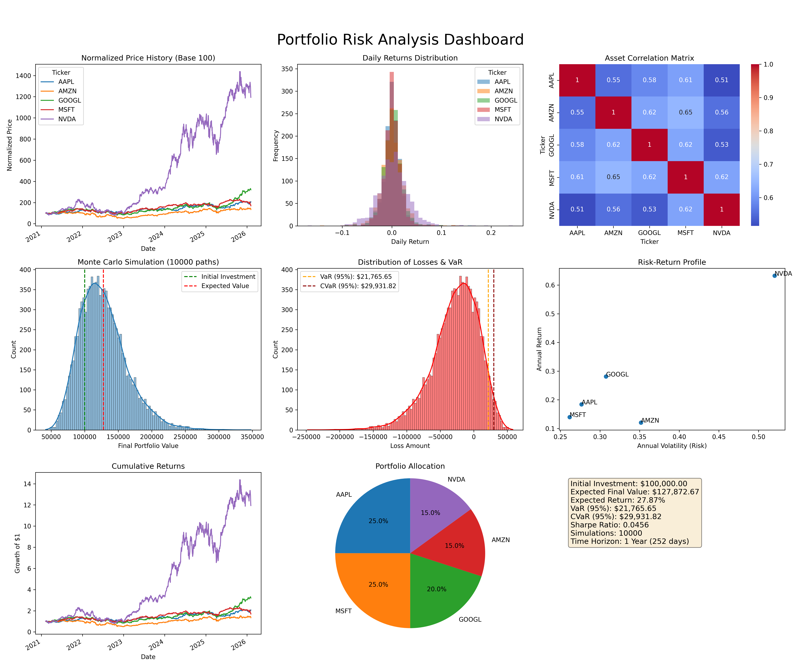

# Portfolio Risk Analytics

A quantitative finance tool for analysing and visualising portfolio risk. Fetches live market data, computes standard risk metrics, and runs Monte Carlo simulations for portfolio optimisation and stress testing.

## Features

- **Risk Metrics** — VaR (Value at Risk), CVaR, Sharpe ratio, Sortino ratio, max drawdown, volatility
- **Monte Carlo Simulation** — thousands of simulated portfolio paths for probabilistic forecasting
- **Data Fetching** — live and historical price data via market data APIs
- **Visualisations** — correlation heatmaps, efficient frontier, drawdown charts, simulation fan plots

## Project Structure

```
portfolio_risk_analytics/
├── main.py              # Entry point — run full analysis
├── data_fetcher.py      # Fetch historical price data
├── risk_metrics.py      # VaR, CVaR, Sharpe, Sortino, drawdown
├── monte_carlo.py       # Monte Carlo portfolio simulation
└── __init__.py
portfolio_risk_analysis.png   # Sample output visualisation
requirements.txt
```

## Getting Started

```bash
# Install dependencies
pip install -r requirements.txt

# Run the analysis
python portfolio_risk_analytics/main.py
```

## Sample Output



## Tech Stack

- **Language**: Python 3
- **Libraries**: pandas, numpy, matplotlib, scipy, yfinance / requests
